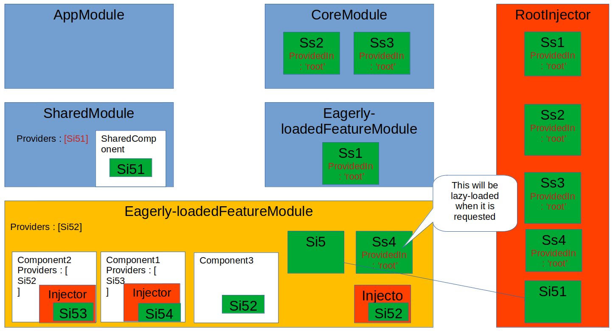
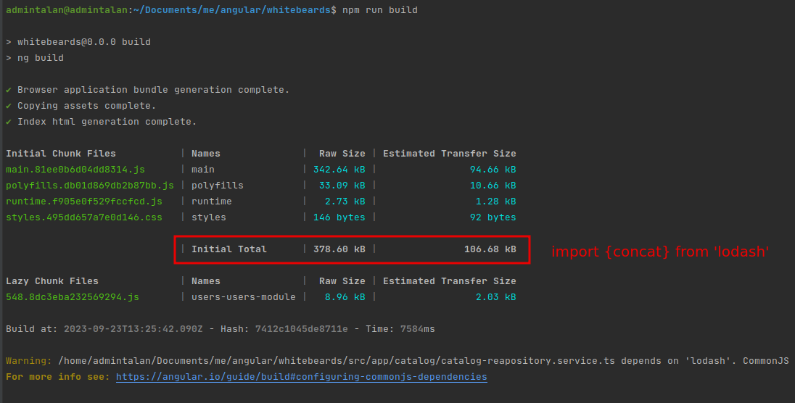
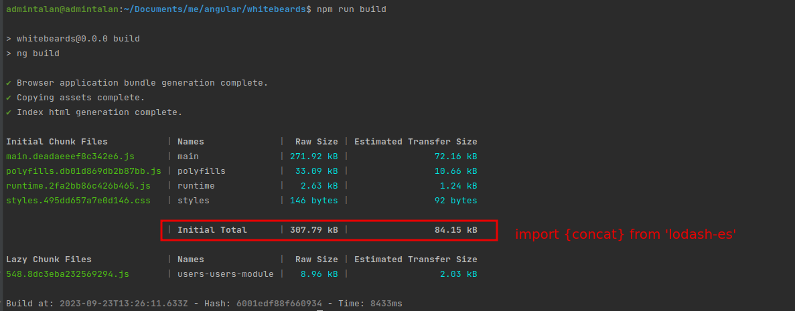
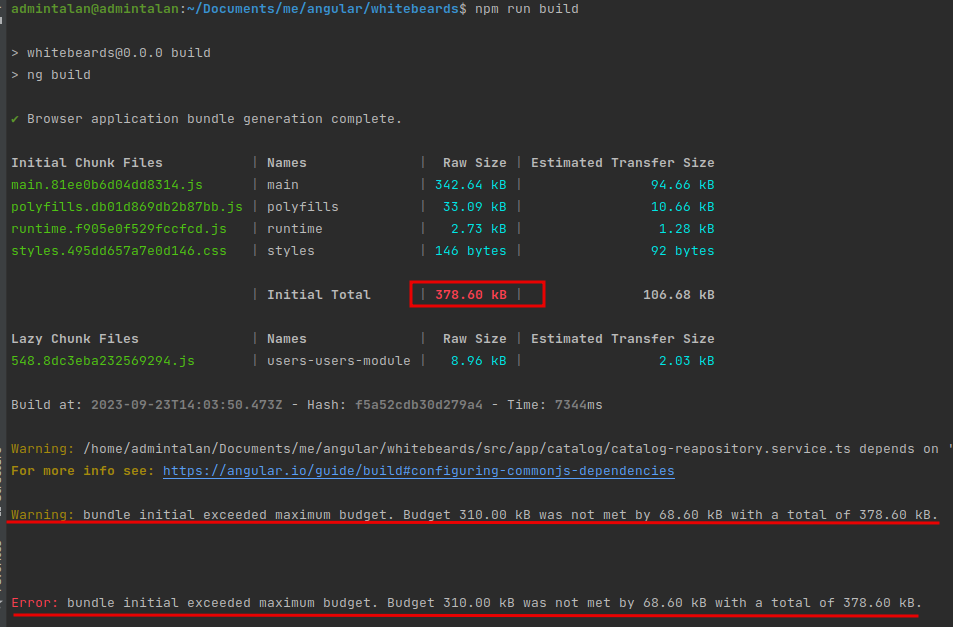

# What is this Repository?
This repository is used along with the [Pluralsight Angular Best Practices course](https://app.pluralsight.com/library/courses/best-practices-angular/table-of-contents). 

Note that as it is here, this repo contains a project with poor practices. As you work through the Angular Best Practices course you will refactor this project to use best practices.

# Whitebeards

This project was generated with [Angular CLI](https://github.com/angular/angular-cli) version 15.2.0.

## Development server

Run `ng serve` for a dev server. Navigate to `http://localhost:4200/`. The application will automatically reload if you change any of the source files.

## Code scaffolding

Run `ng generate component component-name` to generate a new component. You can also use `ng generate directive|pipe|service|class|guard|interface|enum|module`.

## Build

Run `ng build` to build the project. The build artifacts will be stored in the `dist/` directory.

## Running unit tests

Run `ng test` to execute the unit tests via [Karma](https://karma-runner.github.io).

## Running end-to-end tests

Run `ng e2e` to execute the end-to-end tests via a platform of your choice. To use this command, you need to first add a package that implements end-to-end testing capabilities.

## Further help

To get more help on the Angular CLI use `ng help` or go check out the [Angular CLI Overview and Command Reference](https://angular.io/cli) page.

## Tips

# General rule

LIFT : 
- L: locate code quickly
- I: Identify code at a glance
- F: Flattest structure possible
- T: Try to be DRY(Don't Repeat Yourself)

# Setup local environment

- use Node Version Management tool : installation guide [NVM](https://www.freecodecamp.org/news/node-version-manager-nvm-install-guide/).
this tool gives the possibility to work with different node version in the same machine
  - `nvm install 18.10.0`
  - `nvm use 18.10.0`
- Install Angular CLI : [Angular version compatibility](https://angular.io/guide/versions)
  - `npm install -g @angular/cli@version`
- install local web server to test builds : `npm -g http-server`
  - run the web server `http-server dis/directory_of_build`

# Application structure and file naming

- Use the Angular CLI to generate a new project: `ng new project-name`
- Recommended file naming style: **descriptor.type.ts** type: component | service | module etc...

# Folder organization

- Make a folder for each feature/functionality/section/domain. In our case we have to feature catalog and users
- Each folder will contain its main module and its components. For components, try to make the template, style in the same folder.
So we reduce navigating between folders and to locate code will be much easier and faster. This help to make multiple dev teams work on the same project
and each one could handle some modules/folders
- One Item per file. Do not put two components or classes in the same file. Try to make locating elements/items of the code easier and trivial as possible

# General coding best practices

- Use Single Responsibility Principle(SRP): each code item(especially services) should have a single responsibility
- Symbol naming: symbol mean any readable element in our code (variables, classes, constantes...)
  - constants: recommendation is to use camelCase style: TS and IDE will tell us that we're trying to modify a constant. So keep it simple
  - class: UpperCamelCase
- It is a best practice to separate third-party import and local import by an empty line
- Prefer immutability than assigning or changing variables especially objects value directly. This help reducing bugs and guarantee change detection especially for array like onPush Angular hook
- Try to keep functions/methods nice and short, and use smaller methods to clarify more complex code. Doing this makes the really easy to read
- Use strict mode in the tsconfig.json. This reduces any several bugs related to lazy typing. And try to not abuse the use of any by creating the correct datatype for our variables

# Angular Module organization

- It is a best practice to break the app into Feature modules. This helps in performance by lazy loading them.
Also, it provides a high level of encapsulation, and we only expose what's necessary to external modules
- Recommended modules:
  - Routing module: Routes or routes definition. Angular outing imports
  - Core module: isn't technically a recommended module anymore. Used to provide any shred singleton services, as well as any App-level components.
  This is not only mean any shared components but rather components that are only used at a top-level app component(like a navbar component that is used in the AppComponent)
  - Shared module: Provides any shared components, directives and pipes that are used throughout the application: loading-spinning component
  - Feature modules: feature-level modules used to regroup feature-level components, directives, pipes and services. 
  For example the Catalog and User components in our app

# Angular Components

- Use prefixes in component selector, so when importing a module it doesn't conflict with an existing one.
  - prefix has between 2 and 3 characters for easy reading
  - Prefix for an app component (shared component or a core component) has an app prefix, like wb (for whitebeards in our case)
  - Prefix for a feature component could have the 2 beginning characters of the module name. ca for catalog for example
  - Change the general prefix used by the angular cli for generating files in the angular.json config file. The key is "prefix"
- The Angular style guide recommends that If the template or the style are more than 3 lines long we should extract them
- Use Input and Output Decorators instead of component metadata. This will make it easy to detect that a property is an input, 
and also when renaming it we don't have to make changes in multiple places
- Apply SRP by Delegating complex logic to Services
- When using a Lifecycle Hook always implement the Interface, so when mistyping the method name or the signature of the method, 
the IDE or the compiler will alert us of that error

# Angular Services

- Use @Injectable instead of @Inject. Less verbosity when handling dependency injection. Make the service more flexible for future evolution
- As a best practice we provide services with the providedIn root in the service metadata instead of the providers key in the module.
This will register the service as a singleton in the Angular Root Injector, and it will be available for the entire app

- Use Services for data retrieval, like the CatalogRepositoryService in our case 

# Angular performance best practices

- Lazy-load Feature modules
- When lazy-loading a module and it has some services registered in the providers key, we get new instances of them. 
That's why it is considered best practice to use the providedIn root for singleton services
- The use of providers key in the metadata of a component creates a specific injector for that component.
 In this case the registered service is instantiated each time we load the component.
 This is useful in cases we want to have a new instance dedicated for that component
- try to use tree shakable library, so the bundler will compile only the imported functions. This will optimize the size on the app.
This example with 'lodash' not tree shakable and the 'lodash-es' that is tree shakable

with lodash we have the compiled size 106 kB

with lodash-es the size is about 84kB

- Monitor the size of bundles by adjusting the limits on the angular.json file "configurations"/"production"/"budgets" section.
With this config we will be notified with a warning or a build error if a chunk exceeds a limit

